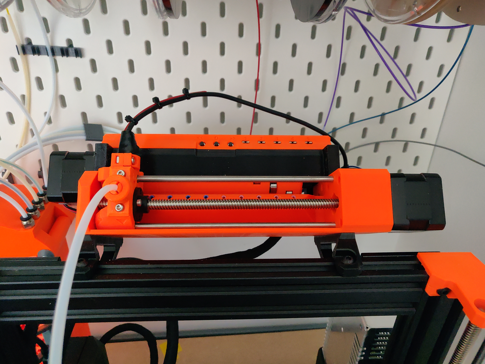
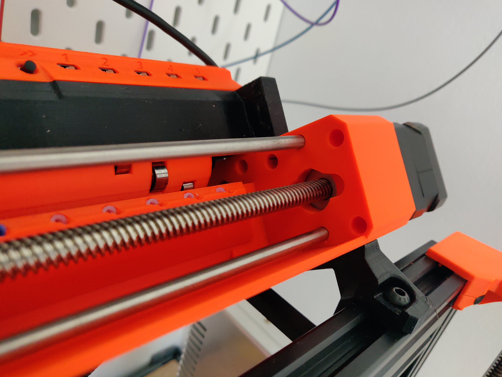
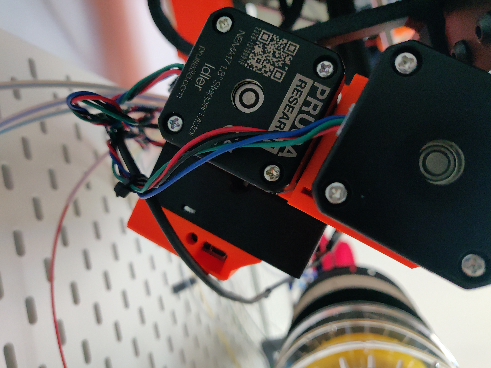
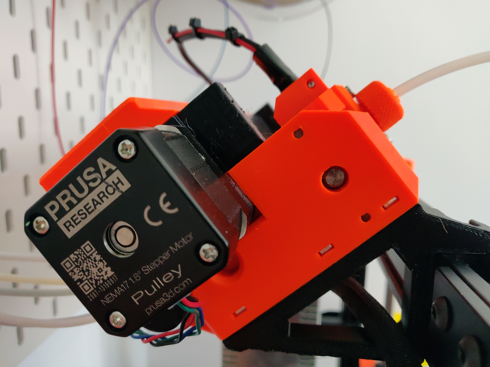
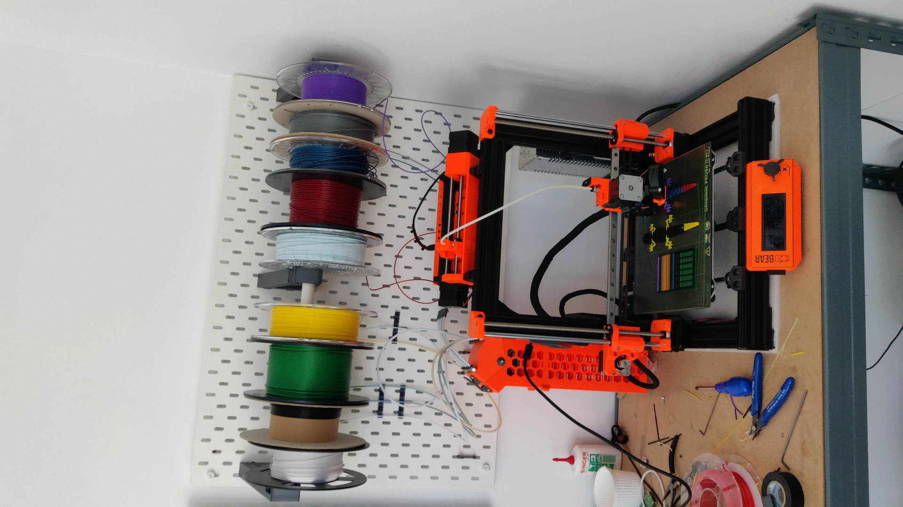
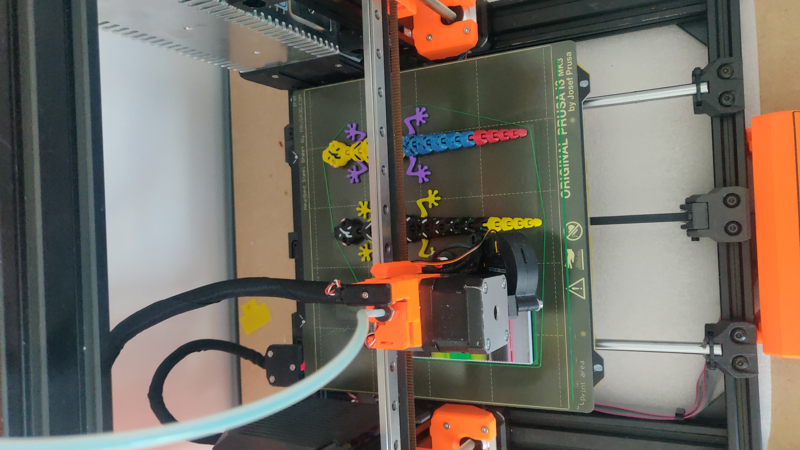
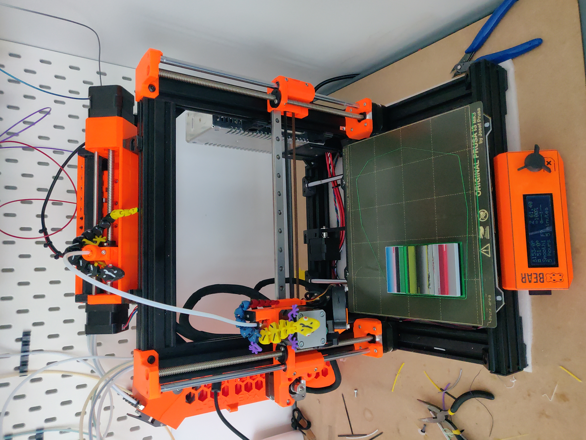

# CM3D-MMU3-10C
## About the 10 colors MMU
This project has been inspired by the work of the @Ryper3D in fact many of their parts has been used on this project because of that I would like to give to them the Kudos that they deserve. If you want to know about their work please visit their [printables profile](https://www.printables.com/es/@Ryper3D_131886)

## AIMS of this project

The aim of this project is to deliver the posibility to use up to 10 different colors on a printer without spend too much money on the way to achive it. If you already own an MMU2/3 unit you will have to spend less than 65€
## BOM

> [!IMPORTANT]
> Is necessary to exchange the Pulley and Idler motor, so the idler motor will be used with for the pulleys in combination of a 5mmx175mm flat shaft and a rigid coupler of 5mm-5mm 

| Item                  | Quantity |    Link    | Aprox. price |
|-----------------------|----------|------------|--------------|
| 190mm leadscrew T8 M8 |        1 |            |           5€ |
| 218.5mm smooth rod M5 |        2 |            |           7€ |
| Nema 17               |        1 |            |          11€ |
| 685-2rs bearings      |       10 |            |           6€ |
| 175mm flat shaft M5   |        1 |            |           8€ |
| Rigid coupler 5mm-5mm |        1 |            |         1.5€ |
| Flex coupler 8mm-5mm  |        1 |            |         1.5€ |
| Shaft 16mm OD5mm      |       10 |            |           4€ |
| GT2 20T Bore 5mm      |        1 |            |         1.5€ |
| ECAS                  |       10 |            |           4€ |
| Filament pulley       |        5 |            |        12.3€ |
| SHCS M3x35mm          |        3 |            |         0.3€ |

## Assembly guide
Basically you will need to follow the assembly guide released by Prusa and apply a little bit of common sense. Is more or less the same 

## What about the Firmware?
* The firmware for the MMU3-10C unit is released on the repository [CM3D-Firmware-MMU](https://github.com/ComunidadMaker3D/CM3D-Firmware-MMU)
* The firmware for the MK3S+ is released on the repository [CM3D-Prusa-Firmware](https://github.com/ComunidadMaker3D/CM3D-Prusa-Firmware)
## How the MMU3-10C looks like?
> [!NOTE]
> All this pictures have been take from my development printer and the pulley body is based on a previous version

## How does it works?
Well, it just works in the same way than the MMU3 from @prusa3d but with the possibility of use the double of colors.

